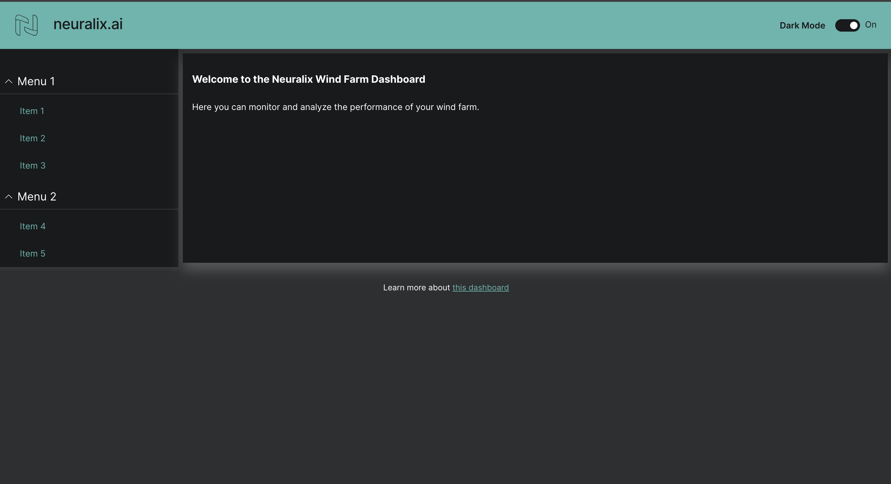
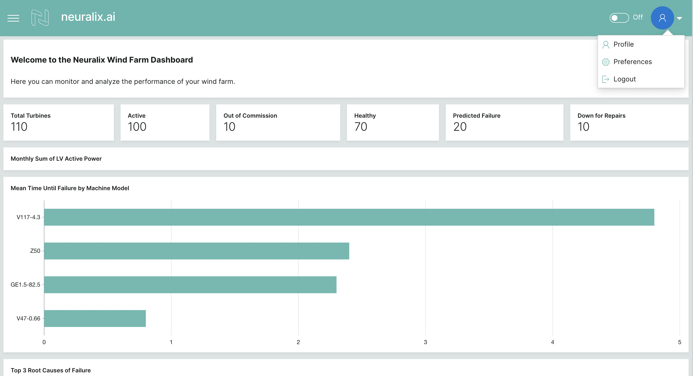
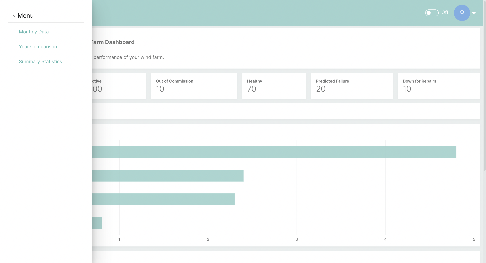
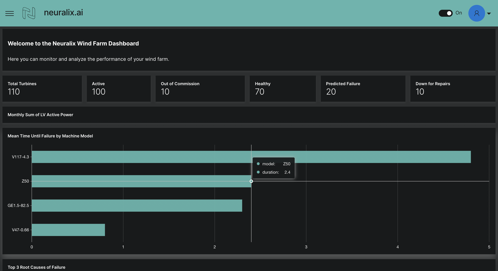

# Neuralix AI Dashboard

A hackathon submission







## 🎒 Tech Stack


## 🖥️ Run Locally

Clone the project

```bash
  git clone https://github.com/Rajkanwars15/neuralix-ai-hackathon-task1
```

Go to the project directory

```bash
  cd neuralix-ai-hackathon-task1
```

Create a virtual environment

```bash
cd waveton/apps/visualization_apps/image_augmentation
python3 -m venv venv
source venv/bin/activate
```

Install the packages

```bash
python3 -m pip install --upgrade pip
python3 -m pip install -r requirements.txt
```

Run the application

```bash
wave run app
```

The Wave server should now be running at http://localhost:10101.

Project Organization
------------

    .
    ├── given                       <- Resources provided by Neuralix
    │   ├── DashboardReferences
    │   ├── Data
    │   ├── Notebooks
    │   ├── PythonPlots
    │   └── README.md
    ├── resources
    │   └── logo
    │   ├── demo
    │   ├── examples
    │   ├── test
    │   ├── www
    │   └── waved
    ├── LICENSE                     <- Project license
    ├── README.md                   <- The top-level README for developers using this project.
    ├── app.py                      <- Python script defining the main functionality of the Wave app.
    ├── cards.py                    <- Python script defining UI components (cards) for the Wave app.
    ├── requirements.txt            <- The requirements file for reproducing the analysis environment
    └── setup.py


--------

<p><small>Generate fresh structure with</small></p>
<small>

```
tree -L 2 --dirsfirst
```
</small>


## 👨‍💻 Author

[
](https://www.github.com/rajkanwars15)